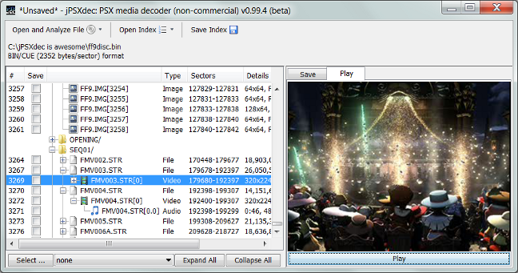

#  jPSXdec

**jPSXdec is a modern, cross-platform PlayStation 1 audio/video converter**  
Also supports extracting files and TIM images.

[ Download]
(https://github.com/m35/jpsxdec/releases/download/v0.99.7/jpsxdec_v0-99-7_rev3397.zip) 
the latest cross-platform version 0.99.7 (beta) (8 Jan 2017)

See [what's new](jpsxdec/doc/CHANGES.txt).

Requires Java version 5 or higher.

Some advantages of jPSXdec over legacy tools of the past:

* Generates higher quality output
* Handles more unique movie types
* Converts with the correct colors (most legacy tools did this incorrectly)
* More accurate frame rate detection
* Cross-platform (Windows, Mac, Linux)
* Source code available 
* Usable from the command-line (for those so inclined)

jPSXdec is free for [non-commercial use](.github/LICENSE.md).

----------------------------------------------------------------------------------

### For developers and modders

jPSXdec offers the ability to replace XA audio, video, and TIM images. Some programming skill is required (see manual for details).

Additionally the PlayStation 1 STR video format is now well documented. View the latest version [PlayStation1_STR_format.txt](jpsxdec/PlayStation1_STR_format.txt).

----------------------------------------------------------------------------------

### Source code

jPSXdec contains some modules of interest.

* A pure Java real-time audio/video player
* A pure Java API writer
* MPEG1* I-frame encoder
* Almost lossless translation of MPEG1* I-frames into JPEG images
* JXTreeTable back-ported to Java 1.5

Great care has been put into the 100k lines of code.

* Consistent code style
* Easy to use API (makes common things easy and hard things possible)
* Modularized so sub-packages could be incorporated into other applications
* Great example that Java programs can be as lean 'n' mean as any other language

* PlayStation 1 video frames are nearly identical to MPEG1 I-frames.